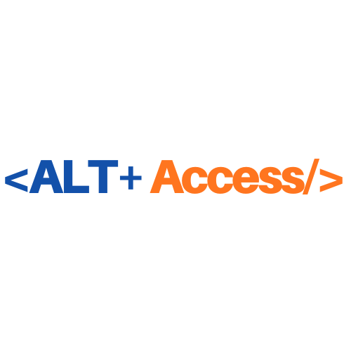
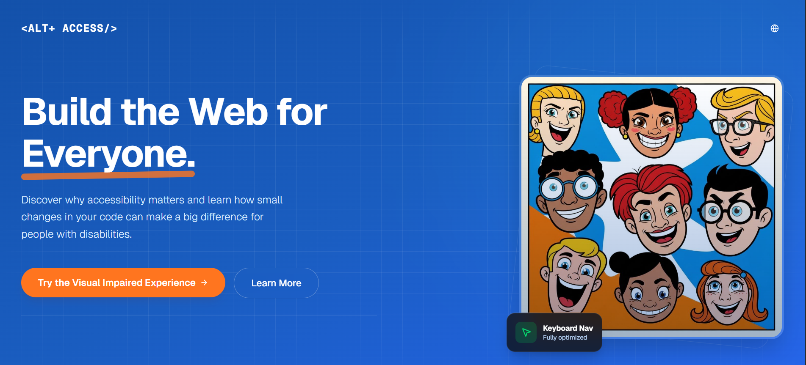

<div align="center">
  <br />
  
  
  <h1>Alt Access</h1>
  <h3>Bridging the Digital Divide in Cambodia</h3>

  <p>
    An interactive educational platform designed to cultivate a national tech ecosystem where accessibility is standard practice.
  </p>

  <!-- BADGES -->
  <p>
    
    
    
    
  </p>
</div>

<br />

## About The Project

**Alt Access** aims to equip the next generation of Cambodian developers with the empathy and technical skills needed to build inclusive digital products for the **120,000+ visually impaired individuals** in the country.

We don't just tell you about accessibility; **we make you feel it.**

### Screenshots
<div align="center"> 
  
</div>


---

## Key Features

### 👁️ Interactive Experience Labs
Simulations designed to build empathy through experience.

| Lab | Description |
| :--- | :--- |
| **Total Blindness** | Simulates a screen-reader environment (Audio-only navigation) using the Web Speech API and keyboard event listeners. |
| **Low Vision** | Simulates cloudy vision (cataracts) and tunnel vision using advanced CSS masking and backdrop filters. |
| **Color Blindness** | A design system inspector that applies accurate SVG color matrices to simulate Protanopia, Deuteranopia, Tritanopia, and Monochromacy in real-time. |

### 📚 Educational Curriculum
*   **Perspective Shift:** Interactive "DevTools" style components that reveal the semantic code hidden behind visual UI elements.
*   **Video Series:** A curated playlist of educational content regarding digital inclusion.
*   **Best Practices:** Actionable tips on WCAG 2.1 compliance, ARIA labels, and color contrast.

### 🇰🇭 Localization
*   **Dual Language:** Full support for **English** and **Khmer (ភាសាខ្មែរ)**.
*   **Accessibility:** Integrated Text-to-Speech (TTS) support for both languages.

---

## 🛠️ Tech Stack

*   **Framework:** [Next.js 15 (App Router)](https://nextjs.org/)
*   **Language:** [TypeScript](https://www.typescriptlang.org/)
*   **Styling:** [Tailwind CSS](https://tailwindcss.com/)
*   **Components:** [Shadcn UI](https://ui.shadcn.com/) (Radix Primitives)
*   **Icons:** [Lucide React](https://lucide.dev/)
*   **Animations:** CSS Keyframes & Tailwind Animate
*   **Audio:** Google Translate TTS API (Unofficial Endpoint)

---

## 🚀 Getting Started

Follow these steps to run the project locally.

### Prerequisites
*   **Node.js** (v18 or higher)
*   **npm**, **pnpm**, or **yarn**

### Installation

1.  **Clone the repository:**
    ```bash
    git clone https://github.com/your-username/alt-access.git
    cd alt-access
    ```

2.  **Install dependencies:**
    ```bash
    npm install
    # or
    pnpm install
    ```

3.  **Run the development server:**
    ```bash
    npm run dev
    ```

4.  **Open your browser:**
    Navigate to [http://localhost:3000](http://localhost:3000) to see the application.

---

## 📂 Project Structure

```bash
├── app/
│   ├── api/tts/         # Serverless function for Text-to-Speech
│   ├── experience/      # Routes for the interactive labs
│   ├── about/           # About Us & Team page
│   ├── layout.tsx       # Root layout & Metadata
│   └── page.tsx         # Landing Page
├── components/
│   ├── ui/              # Reusable UI components (Buttons, Cards, etc.)
│   ├── hero-section.tsx # Main landing visual
│   └── ...
├── hooks/
│   └── use-language.tsx # Global language state management
├── lib/
│   └── translations.tsx # Dictionary for EN/KM text
└── public/              # Static assets (images, icons)
